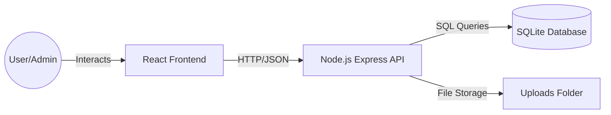

# 📚 Full-Stack E-Book Management System:

This project is a comprehensive, automated E-Book Management System built to facilitate library operations. It features a modern React frontend and a robust Node.js/Express backend with a local SQLite database.

---

## 🏗️ System Architecture

The system is split into two distinct parts that communicate over a RESTful API:



---

## 🛠️ Tech Stack

### Frontend (The Face)
- **Library:** React 18
- **Routing:** React Router DOM v6
- **API Client:** Axios
- **Styling:** Custom CSS (Modular & Responsive)
- **State Management:** Local State & React Context

### Backend (The Brain)
- **Runtime:** Node.js
- **Framework:** Express.js
- **Database:** SQLite (via `better-sqlite3`)
- **Authentication:** JWT (JSON Web Tokens) (simplified verification)

---

## 📂 Project Structure

### 📁 [Frontend](file:///d:/ebook/ebook-management-frontend)
- `src/components/`: Reusable UI elements (Navbar, Book Cards, etc.).
- `src/pages/`: Main views (Dashboard, Login, Admin Panel).
- `src/services/api.js`: **The Bridge.** Contains the Axios configuration and all API endpoints.
- `src/context/`: Manages global state like User Authentication.
- `public/`: Static assets and the main HTML entry point.

### 📁 [Backend](file:///d:/ebook/ebook-management-backend)
- `src/server.js`: The Entry Point. Initializes the database and starts the server.
- `src/db/`: Database schema, tables initialization, and seed data.
- `src/controllers/`: The Logic. Handles the actual code for adding books, logging in, etc.
- `src/routes/`: The Maps. Defines the URL paths (e.g., `/api/books`) and links them to controllers.
- `src/middleware/`: Security checks. Validates JWT tokens before allowing access.
- `uploads/`: Physical storage for PDF files.

---

## 🔄 Core Workflows

### 1. Identity & Security Workflow (Authentication)
1. **Request:** User enters credentials in React.
2. **Transfer:** Axios sends a `POST` request to `/api/auth/login`.
3. **Verification:** Backend checks the database and validates the password hash.
4. **Token:** Backend generates a JWT and sends it back to the Frontend.
5. **Session:** Frontend saves this token in `localStorage`.
6. **Persistence:** For every future request, the Frontend attaches this token to the `Authorization` header so the Backend knows who is asking.

### 2. Data & Asset Workflow (Book Management)
1. **Creation:** Admin uploads a book via a form.
2. **Handling:** Backend uses **Multer** to save the PDF file into the `uploads/` folder.
3. **Indexing:** Metadata (title, path, category) is saved into the `books` table in SQLite.
4. **Discovery:** When a user visits the Dashboard, React fetches the list of books via a `GET` request.
5. **Access:** When a user clicks "Download" or "View," the Frontend links directly to the Backend's static file server.

---

## 🔗 How Connections are Made

### 1. The URL Bridge
The Frontend is hardcoded to look for the Backend at `http://localhost:5000/api`. This is defined in `frontend/src/services/api.js`.

### 2. The CORS Gatekeeper
By default, browsers block one website from talking to another. In `backend/src/server.js`, we use the **CORS** middleware to explicitly allow your Frontend to make requests.

### 3. Database Persistence
Unlike MongoDB or MySQL which require a separate server, this project uses **SQLite**. It stores everything in a single file called `ebook.db` inside the backend folder. This makes the project extremely portable.


## 🚀 Getting Started

You can now easily install dependencies and run both servers from the root folder of the project using npm workspaces.

### 1. Install Dependencies
Install all modules for both the frontend and backend in one command from the root:
```bash
npm run install:all
```

### 2. Configure Environment (Backend)
Check that the `.env` file exists in `ebook-management-backend/` (it is pre-configured with a default secret):
```env
PORT=5000
JWT_SECRET=super_secret_key_123
```

### 3. Run the App
Start both the Express server and the React frontend concurrently:
```bash
npm run dev
```
* The frontend will load automatically at `http://localhost:3000`.
* The backend API server will run at `http://localhost:5000`.
